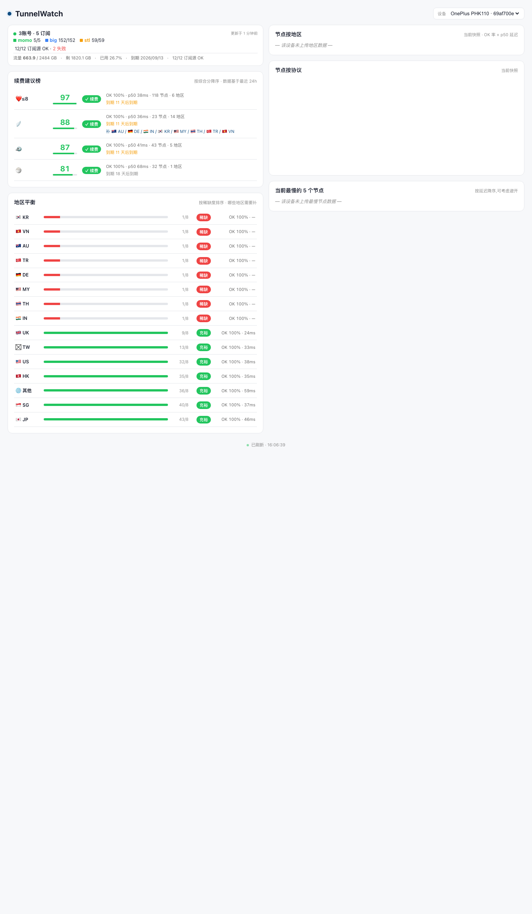

# TunnelWatch 状态面板

> TunnelWatch Android App 的遥测展示端 — Cloudflare Pages + D1 + Functions。


## 预览



---

App 端:每次 widget 刷新(FULL 拉取 + PROBE 测活)把 `ProxyStatus` 上报到 `/api/ingest`;
服务端:写 D1,15 分钟窗口去重;
展示端:静态前端拉 `/api/devices` / `/api/latest` / `/api/history` 渲染卡片镜像 + 4 张 24h 趋势图。

## 本地开发

### 1. 装依赖 + 初始化 D1

```bash
cd ~/TunnelWatchPage
npm install                # 装 wrangler + types(本地 dev,不需要 Cloudflare 账号)
npm run db:init            # 在本地 D1 创建表(devices + snapshots)
npm run db:seed            # 插入 24h 假数据 + 1 个授权设备(0x...0001 DevTestPhone)
```

### 2. 启动 dev server

```bash
npm run dev
# 启动后访问 http://localhost:8788
```

`wrangler pages dev` 同时提供:
- 静态文件 `public/`(HTML / CSS / JS)
- Pages Functions `functions/api/*`(TypeScript 实时编译)
- 本地 D1(`.wrangler/state/v3/d1/...` 下的 SQLite 文件)

修改 `functions/*.ts` 或 `public/*` 改完保存即生效(有 live reload)。

### 3. 让真机 App 上报到本地

App 默认 `tw.telemetry.url` 为空(不上传)。要让它打到本地 dev:

**a) 在 TunnelWatch 仓库配 URL**
```bash
# ~/TunnelWatch/local.properties
tw.telemetry.url=http://localhost:8788
```

**b) 把手机的 localhost 反向到 Mac**
```bash
adb reverse tcp:8788 tcp:8788
```

**c) 重建 + 装机 + 触发 widget 刷新**
```bash
cd ~/TunnelWatch && ./gradlew :app:assembleDebug
adb install -r app/build/outputs/apk/debug/app-debug.apk
adb shell am force-stop tech.tunnelwatch.app
adb shell am start -n tech.tunnelwatch.app/.MainActivity
# 或者点 widget / App 内"刷新"按钮
```

**d) 验证**
```bash
# wrangler dev 控制台会显示 POST /api/ingest + 200 OK
# 或者查询:
npm run db:query -- "SELECT kind, datetime(ts/1000, 'unixepoch') as t, summary_json FROM snapshots ORDER BY ts DESC LIMIT 5"
```

## 目录结构

```
TunnelWatchPage/
├── wrangler.toml             # D1 binding + Pages 配置
├── package.json              # scripts: dev / db:init / db:seed / db:query / db:reset
├── tsconfig.json             # Pages Functions TS 配置
├── migrations/
│   └── 0001_init.sql         # devices + snapshots 表
├── functions/
│   └── api/
│       ├── ingest.ts         # POST,鉴权 + 15min dedup
│       ├── latest.ts         # GET,最新一条
│       ├── history.ts        # GET,24h 窗口内所有
│       └── devices.ts        # GET,授权设备列表
├── public/
│   ├── index.html            # 前端骨架
│   ├── style.css             # 极浅色 + 1dp 描边,跟 App 卡片风格一致
│   └── app.js                # 拉 API + 渲染 4 张图
└── scripts/
    └── seed.mjs              # 24h 假数据生成器
```

## API 契约

### POST /api/ingest

Header: `X-Device-Uuid: <uuid>`(必须在 `devices` 表里)

Body:
```json
{
  "kind": "full" | "probe",
  "ts": 1735689600000,
  "deviceUuid": "...",
  "deviceName": "OnePlus PHK110",
  "summary": { "online": true, "serverName": "...", "quotaUsedGB": 142.3, ... },
  "payload": { /* 完整 ProxyStatus JSON,跟 App 端 StatusCache.encodeFull 输出对齐 */ }
}
```

Response: `{ ok: true, id: <rowId>, dedupDeleted: <count> }`

### GET /api/devices

Response: `{ devices: [{ uuid, name, createdAt, lastSeenAt }, ...] }`

### GET /api/latest?device=<uuid>&kind=<full|probe>

Response: `{ id, device, deviceName, kind, ts, summary, payload }`

### GET /api/history?device=<uuid>&hours=<24>&kind=<full>

Response: `{ device, hours, kind, items: [{ id, ts, kind, summary }, ...] }`

## 部署到 page.dev(待办)

1. `wrangler login` 登录 Cloudflare
2. `wrangler d1 create tunnelwatch` 创建远程 D1,把输出的 `database_id` 填进 `wrangler.toml`
3. `wrangler d1 execute tunnelwatch --remote --file=migrations/0001_init.sql` 跑 schema
4. 在 App 设置页复制设备 UUID,跑:
   `wrangler d1 execute tunnelwatch --remote --command "INSERT INTO devices (uuid, name) VALUES ('<uuid>', 'MyPhone')"`
5. `wrangler pages deploy public --project-name=tunnelwatch` 部署
6. 把 `~/TunnelWatch/local.properties` 的 `tw.telemetry.url` 改成 `https://<project>.page.dev`,重建装机

## License

[MIT](./LICENSE) — 详见 LICENSE 文件。
